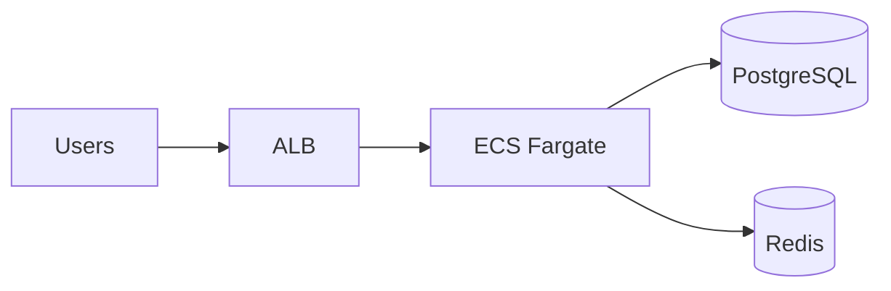

# CloudForge

A production-grade cloud infrastructure platform demonstrating AWS architecture, Infrastructure as Code, container orchestration, CI/CD, and observability.

## Architecture

Three-tier containerized API on AWS:

- **Edge:** Application Load Balancer (public subnets)
- **Compute:** ECS Fargate (private subnets)
- **Data:** RDS PostgreSQL + ElastiCache Redis (private subnets)



## Tech Stack

| Layer | Technology |
|-------|------------|
| Infrastructure | Terraform |
| Container | Docker |
| Orchestration | ECS Fargate |
| Application | Python FastAPI |
| CI/CD | GitHub Actions |
| Cloud | AWS |

## AWS Services

VPC, Subnets, Security Groups, ALB, ECS Fargate, RDS PostgreSQL, ElastiCache Redis, CloudWatch, IAM, Secrets Manager, S3, Route53 (optional HTTPS)

## Prerequisites

1. AWS account with admin access
2. [AWS CLI v2](https://aws.amazon.com/cli/) configured
3. [Terraform](https://www.terraform.io/) >= 1.7
4. [Docker](https://www.docker.com/) (for local image builds)
5. GitHub repository with `dev` and `prod` environments

## Quick Start

```bash
# 1. Bootstrap remote state (once per AWS account)
make bootstrap

# 2. Configure environment
export AWS_PROFILE=cloudforge
export AWS_REGION=us-east-1

# 3. Deploy
make deploy ENV=dev
```

## Project Structure

```
CloudForge/
├── app/                    # FastAPI application
├── infrastructure/terraform/
│   ├── bootstrap/          # S3 + DynamoDB for remote state
│   ├── modules/            # Reusable Terraform modules
│   └── environments/       # dev / prod configurations
├── .github/workflows/      # CI/CD pipelines
├── docs/                   # Architecture, runbooks, portfolio
└── scripts/                # Deploy and rollback scripts
```

## Commands

| Command | Description |
|---------|-------------|
| `make bootstrap` | Create S3 state bucket + DynamoDB lock table |
| `make plan ENV=dev` | Preview infrastructure changes |
| `make apply ENV=dev` | Apply infrastructure changes |
| `make deploy ENV=dev` | Full deploy (infra + image + ECS) |
| `make destroy ENV=dev` | Tear down environment |
| `make lint` | Lint Python code |
| `make test` | Run application tests |

## Environments

| | dev | prod |
|---|-----|------|
| NAT Gateway | 1 | 2 |
| ECS tasks | 1 | 2+ |
| RDS | single-AZ micro | Multi-AZ small |
| HTTPS | HTTP only | HTTP → HTTPS when domain configured |

## CI/CD

- **CI** (on PR/push): lint, test, Docker build, Trivy scan
- **CD** (workflow dispatch): Terraform apply + ECS deploy
- **Rollback:** `scripts/rollback.sh dev <image-tag>` or ECS circuit breaker

## Documentation

- [Architecture](docs/architecture/) — AWS service explanations and tradeoffs
- [Runbooks](docs/runbooks/) — Deploy, rollback, incident response
- [Portfolio](docs/portfolio/) — Design decisions and cost estimates

## Security

- IAM least privilege with separate ECS execution/task roles
- GitHub Actions OIDC (no long-lived AWS keys)
- Secrets in AWS Secrets Manager
- Private subnets for compute and data tiers
- Encryption at rest for RDS and S3 state

## Cost Estimate

| Environment | Approximate monthly cost |
|-------------|-------------------------|
| dev | $80–120 |
| prod | $200–350 |

Run `make destroy ENV=dev` when not in use to avoid charges.

## License

MIT
