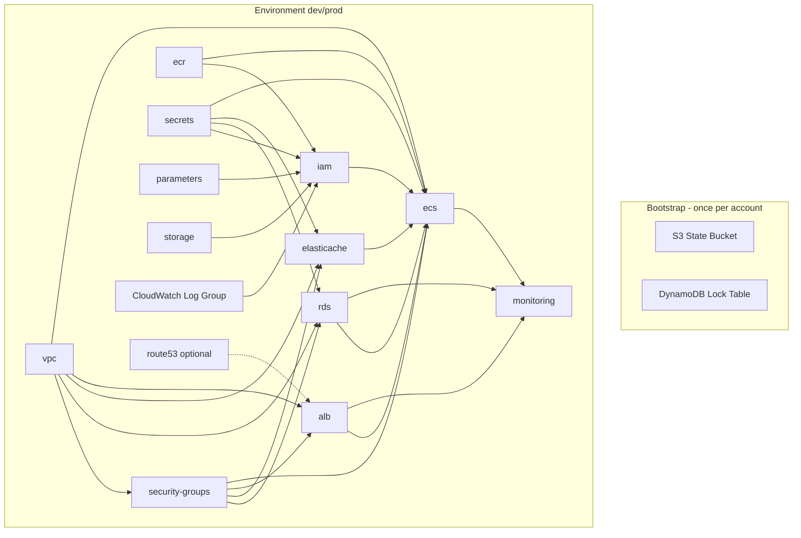

# Terraform Module Dependency Diagram

## Module Responsibilities

| Category | Modules |
|----------|---------|
| Networking | `vpc`, `security-groups` |
| Compute | `ecs`, `alb` |
| Storage | `storage`, `ecr` |
| IAM | `iam` |
| Security | `secrets`, `parameters` |
| Databases | `rds`, `elasticache` |
| Monitoring | `monitoring` |
| DNS/TLS | `route53` |
| Remote State | `bootstrap` |

## State Separation

- **Bootstrap state:** Local or separate backend (S3 bucket it creates)
- **Environment state:** `cloudforge/{env}/terraform.tfstate` in remote S3

This prevents environment destroys from affecting the state backend itself.
