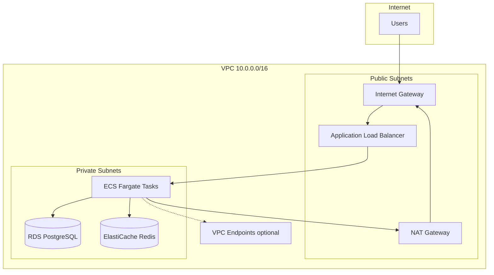

# AWS Network Diagram



## Subnet Layout

| Subnet | CIDR | Tier | Resources |
|--------|------|------|-----------|
| public-az-a | 10.0.1.0/24 | Public | ALB, NAT |
| public-az-b | 10.0.2.0/24 | Public | ALB, NAT (prod) |
| private-az-a | 10.0.10.0/24 | Private | ECS, RDS, Redis |
| private-az-b | 10.0.20.0/24 | Private | ECS, RDS, Redis |

## Security Group Flow

```
0.0.0.0/0:80,443 → ALB SG → ECS SG:8000 → RDS SG:5432
                                      └──→ Redis SG:6379
```

## Traffic Paths

1. **Inbound:** User → ALB (public) → ECS task (private, no public IP)
2. **Outbound:** ECS → NAT Gateway → Internet (package updates, external APIs)
3. **Internal:** ECS → RDS/Redis within VPC (no internet traversal)
