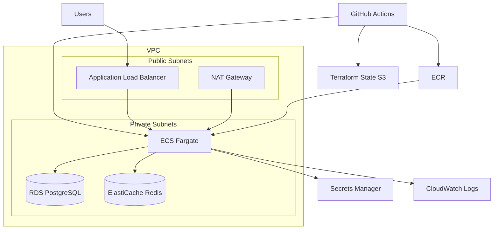
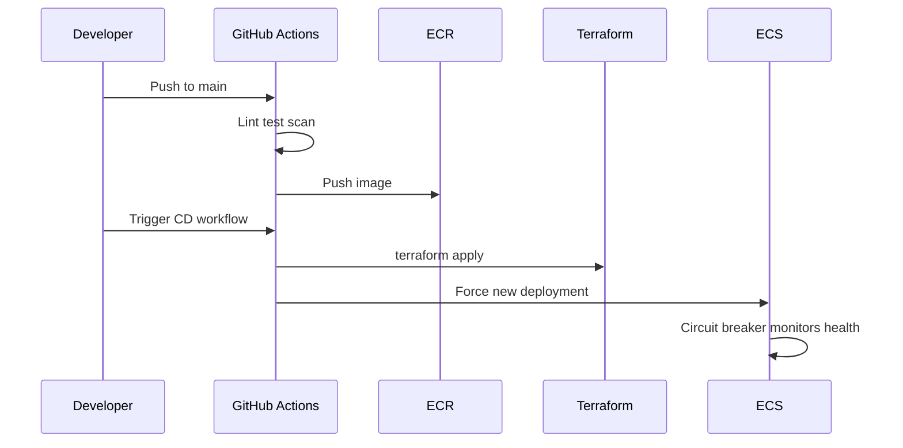

# CloudForge Architecture

## System Context

## CI/CD Flow

## Portfolio Highlights

- **Infrastructure as Code:** 10+ reusable Terraform modules
- **Container orchestration:** ECS Fargate with auto-rollback
- **CI/CD:** GitHub Actions with OIDC, no static AWS keys
- **Observability:** CloudWatch dashboards, alarms, structured logging
- **Security:** Network isolation, Secrets Manager, least-privilege IAM
- **Multi-environment:** dev + prod with separate VPCs and state

See [design-decisions.md](design-decisions.md) for detailed rationale.
